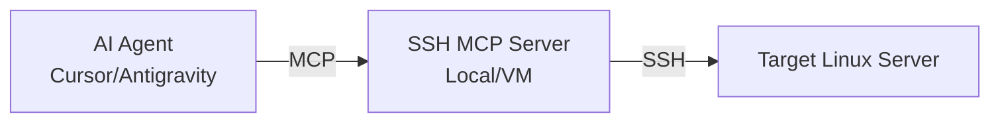

# SSH MCP Server - Secure Remote Command Execution

[](https://opensource.org/licenses/MIT)
[](https://www.python.org/downloads/)
[](https://modelcontextprotocol.io/)

This project is an MCP (Model Context Protocol) server that allows you to **securely** and **controllably** run commands on your Linux servers via AI agents (Cursor, Antigravity, Claude Desktop, etc.).

## 🎯 Key Features

- 🛡️ **Security Focused**: Only commands explicitly allowed by you (Allowlist) can be executed.
- 🔑 **Secure Access**: Uses SSH Key-based authentication; no passwords required.
- ⏱️ **Timeout Protection**: Automatically terminates long-running commands.
- 📊 **Detailed Output**: Presents command results (stdout, stderr, exit code) in a clean format to the agent.
- 🛠️ **Integrated Tools**: Includes tools for connection testing, configuration viewing, and listing permitted commands.

## 🏗️ Architecture



**Why This Middleware Layer?**
1. Instead of giving the AI agent direct terminal access, you restrict it to specific operations.
2. Regex-based allowlist prevents command injection and unauthorized file access.
3. The connecting user (`ai-runner`) can be isolated with minimal privileges on the target server.

## 🚀 Quick Start

### 1. Prerequisites
- Python 3.10+
- A restricted SSH user on the target server (e.g., `ai-runner`)
- SSH Key (located in `~/.ssh/` on your local machine)

### 2. Installation
```bash
git clone https://github.com/volkan-m/ssh-mcp-server.git
cd ssh-mcp-server
python -m venv venv
source venv/bin/activate  # On Windows: venv\Scripts\activate
pip install -r requirements.txt
```

### 3. Configuration
Set the following environment variables:

| Variable | Description | Default |
|----------|----------|------------|
| `SSH_HOST` | Server IP or Hostname | *Required* |
| `SSH_USER` | SSH Username | `ai-runner` |
| `SSH_KEY` | Path to Private Key | `~/.ssh/ai_runner` |
| `SSH_PORT` | SSH Port | `22` |
| `COMMAND_TIMEOUT` | Max Command Duration (sec) | `30` |

### 4. Running
```bash
python ssh_mcp_server.py
```

## 📖 Detailed Documentation

Check the `docs/` folder for more detailed guides:

- 📥 [Quick Start Guide](docs/QUICKSTART.md)
- 🔑 [SSH Key Preparation](docs/SSH-KEY-SETUP.md)
- 🤖 [Antigravity/Cursor Integration](docs/ANTIGRAVITY-SETUP.md)

## 🛡️ Security and Allowlist

Permitted commands are defined as regex patterns in the `ALLOWED_COMMANDS` list within `ssh_mcp_server.py`.

**Example:**
```python
ALLOWED_COMMANDS = [
    r"^systemctl status [a-zA-Z0-9.-]+$",  # Only status checks
    r"^df -h$",                            # Disk usage
]
```

## 🎮 Tools

- `ssh_exec(command)`: Executes the specified command.
- `ssh_test_connection()`: Validates the server connection.
- `ssh_list_allowed()`: Lists permitted command patterns.
- `ssh_get_config()`: Displays the current runtime configuration.

## 🤝 Contributing

1. Fork the project.
2. Create a feature branch (`git checkout -b feature/NewFeature`).
3. Commit your changes (`git commit -am 'Add new feature'`).
4. Push to the branch (`git push origin feature/NewFeature`).
5. Open a Pull Request.

## 📄 License

This project is licensed under the **MIT License**. See the [LICENSE](LICENSE) file for details.

---
**Developed by:** volkan-m 
**Version:** 1.1.0
